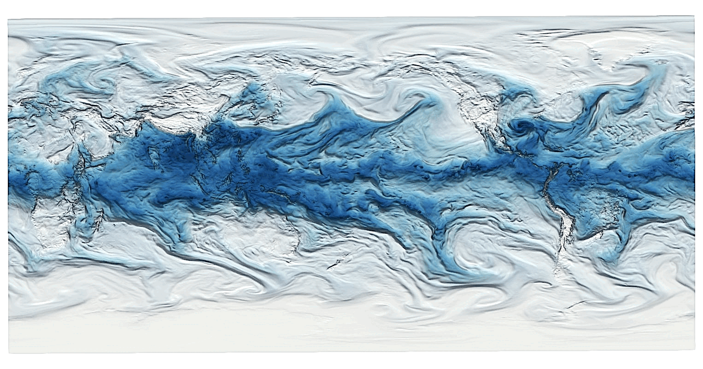
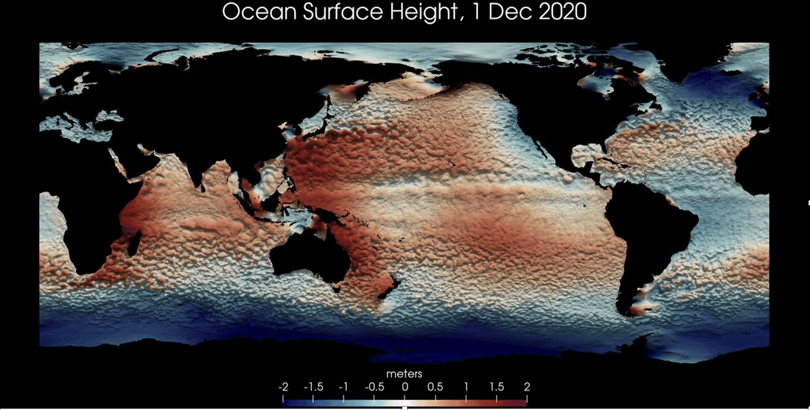

# Data Visualizations

Some data visualizations I have made are shown below (click for larger iamge). You are welcome to freely use these for educational or press purposes, with attribution to "Mathew Barlow, University of Massachusetts Lowell."

See also my gallery of [animations](https://github.com/mathewbarlow/animations).

<b> hycom_sfc_currents.gif </b>

Average surface currents in the HYCOM model, made with ParaView. The flow in the gyres is so much slower than the western boundary currents, they are difficult to visualize with vectors, so I made this image showing streamlines. 

  

<b> fire_13_june_2025.gif </b>

Estimate of wild fire smoke on 13 June 2025, based on total column carbon monoxide from the Copernicus Atmosphere Monitoring Service (CAMS), made with ParaView.

  

<b> era5_pwat_still_image.gif </b>

Total amount of moisture in the atmosphere on a single day, made with ParaView. The effect of large mountain ranges is evident, as is the difference between the convective, bubbly nature of the tropics versus the baroclinic, swirly nature of the midlatitudes.

  

<b> ocean_sfc_height.gif </b>

Height of the ocean surface on a single day (excluding tides), made with ParaView. Note that the ocean surface in the western Pacific is more than 4 meters (13 feet) higher than the ocean surface in the Southern Ocean!

  
