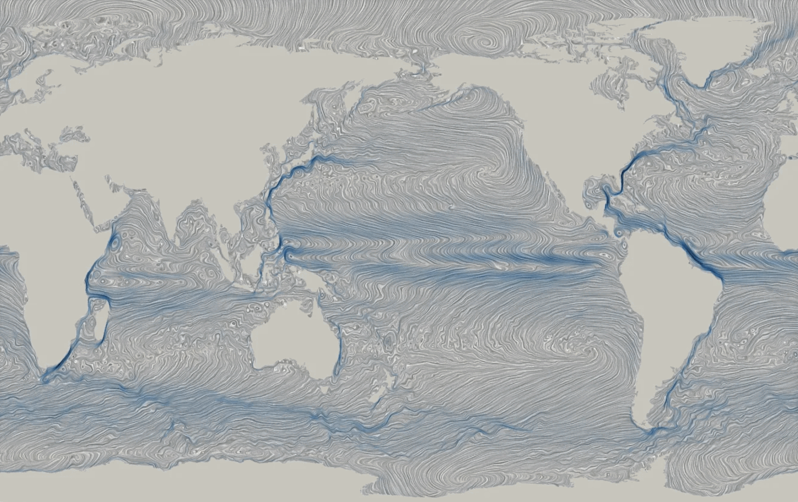
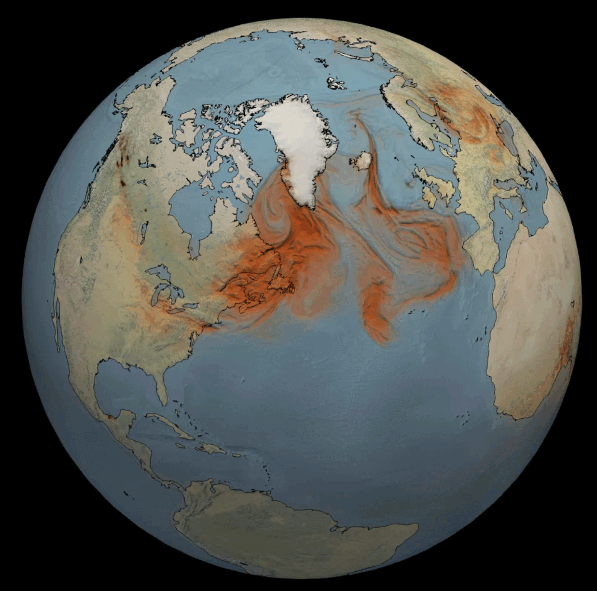

# Data Visualizations

Some data visualizations I have made are shown below (click for larger iamge). You are welcome to freely use these for educational or press purposes, with attribution to "Mathew Barlow, University of Massachusetts Lowell."

See also my gallery of [animations](https://github.com/mathewbarlow/animations).

<b> hycom_sfc_currents.gif </b>

Average surface currents in the HYCOM model, made with ParaView.

  

<b> fire_13_june_2025.gif </b>

Estimate of wild fire smoke on 13 June 2025, based on total column carbon monoxide from the Copernicus Atmosphere Monitoring Service (CAMS), made with ParaView.

  
